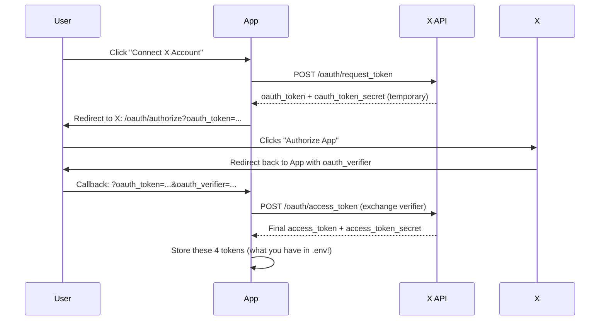

# X OAuth 1.0a — 3-Legged Login Flow

What you have in `.env` is the **end state** — the 4 tokens after a user has already authorized. The full flow that apps like Buffer use:

## The 3-Legged OAuth 1.0a Flow

## What you'd need to build

1. **A callback URL** — X redirects the user back to `https://yoursite.com/auth/callback?oauth_token=...&oauth_verifier=...`
2. **Temporary token storage** — Hold the `oauth_token_secret` in a session/cookie between step 2 and the callback
3. **Token exchange** — One POST to swap the verifier for permanent access tokens
4. **Store the tokens** — Save the final 4 tokens per user in a database

That's basically it. The OAuth 1.0a signing code you already have in `x-post.mjs` is the same — you just need two extra endpoints:

| Endpoint | Purpose |
|---|---|
| `POST /oauth/request_token` | Get temporary tokens |
| `POST /oauth/access_token` | Exchange verifier for permanent tokens |

## For a Next.js site

You could add an API route at `app/auth/x/callback/route.ts` that handles the redirect and token exchange. The hardest part is session management (keeping track of which user just logged in), not the OAuth itself. With the `oauth-1.0a` npm package already in `package.json`, it's about 30 lines of code.
